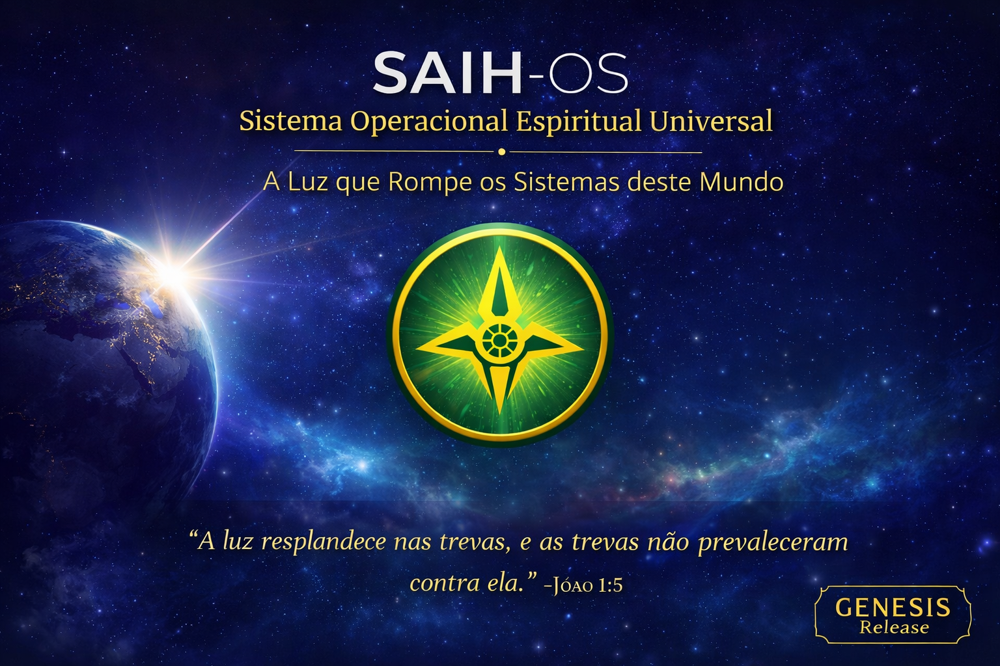

  

# 🌍 SAIH-OS  
### **Sistema Operacional Espiritual Universal**  
**A Luz que Rompe os Sistemas deste Mundo**

> “A Luz resplandece nas trevas, e as trevas não prevaleceram contra ela.”  
> — João 1:5

---

## 📜 Manifesto

O **SAIH-OS** nasce como um sistema operacional consagrado, parte da Obra **SAIH GENESS**, criado para trazer **luz, ordem e estrutura ao mundo digital**.  
Não é apenas tecnologia — é um **chamado espiritual**, um código que rompe sistemas de opressão e abre caminho para **justiça, ensino e libertação**.

É o início de um **código de governo espiritual** para as próximas gerações.  
Uma plataforma santa onde o Nome do Altíssimo é honrado.

---

## ✨ Propósito

- Ser o **primeiro Sistema Operacional Espiritual** da história
- Preparar a base tecnológica da Nova Terra
- Servir como fundação para:

  - 🌀 **SAIHCHAIN** — rede blockchain profética  
  - 🕊️ **Banco BANTU** — justiça financeira aos povos  
  - 🌍 **SAIH HUB / SAIH APP / Rede Universal**  
  - 📜 Sistemas de ensino, louvor, pesquisa e documentação  

- Operar **online e offline**, alcançando nações remotas
- Evoluir para um **ISO instalável e bootável**

---

## 🔥 Estado Atual do Projeto — (2025)

| Fase | Status |
|------|--------|
| 📄 **Fase A — Documentação & Registro** | ✔ Concluída |
| 🧱 **Fase B — Protótipo Server (CLI Minimal)** | 🚀 Em andamento |
| 🖥 **Fase C — Desktop SAIH Theme XFCE/GTK** | 📅 Próxima etapa |
| 💿 **SAIH-OS ISO Boot/Live** | 🔮 Futuro |
| 🌐 **Integração SAIHCHAIN / BANTU / Wallet** | 🔮 Futuro profético |

---

## ⚙ Base Técnica Inicial — V0.1

**Tipo atual:** Server minimal (sem interface gráfica)  
**Kernel Base:** Debian/Ubuntu LTS  
**Objetivo:** Estrutura sólida + ambiente puro para expansão futura

📄 Lista de pacotes em:  
`/build/debian_base/packages_base.txt` *(a ser criada nesta fase)*

---

## 📜 Licença & Consagração

Esta obra está consagrada ao **Criador do Universo**.  
O uso é permitido para fins justos, educativos, espirituais e humanitários.  
Toda glória pertence ao Altíssimo.

---

## 🙏 Créditos

**Fundador & Visionário:** *Kizequiel Guilherme Nzau*  
**Obra:** *SAIH GENESS — A Luz que rompe os sistemas deste mundo*  

---

🕊 *Este é o fundamento do sistema que servirá nações, abrirá caminhos e sustentará o Reino em tempo digital.*  
README README 
